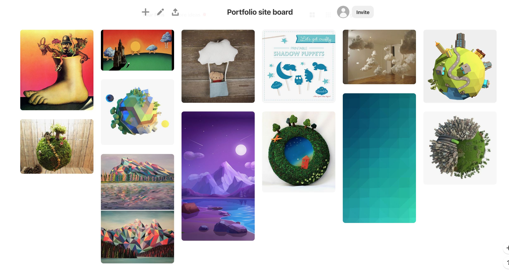
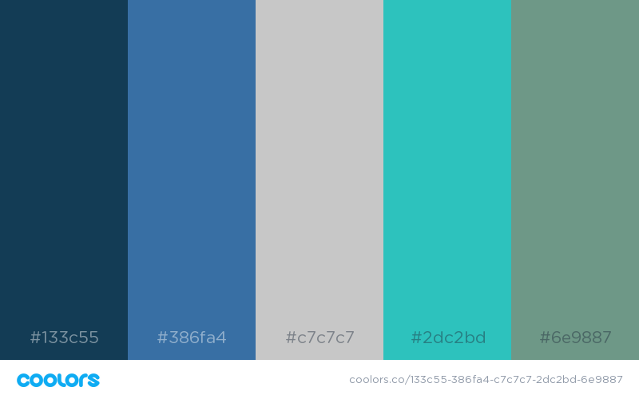
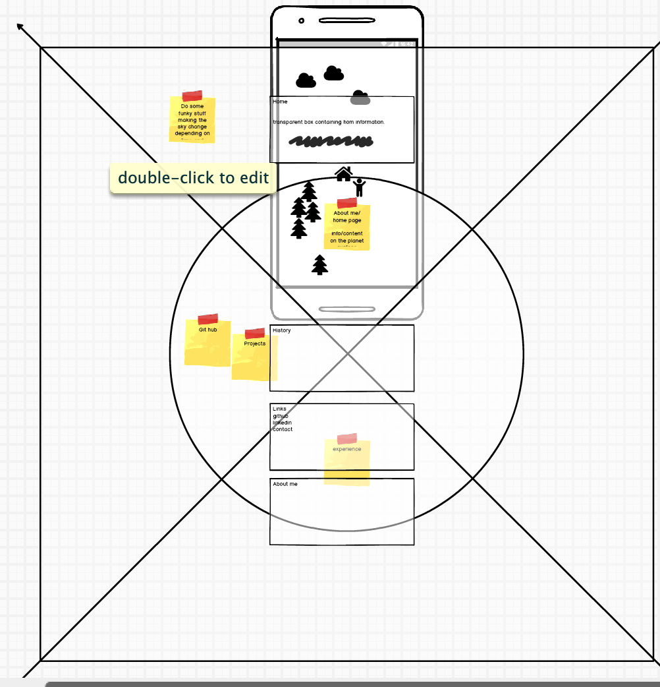
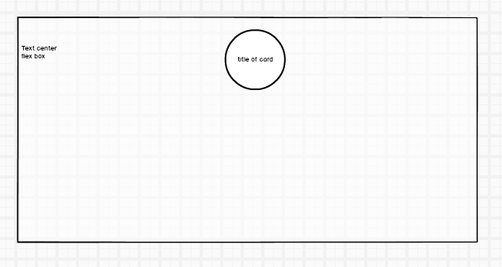
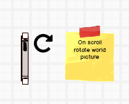
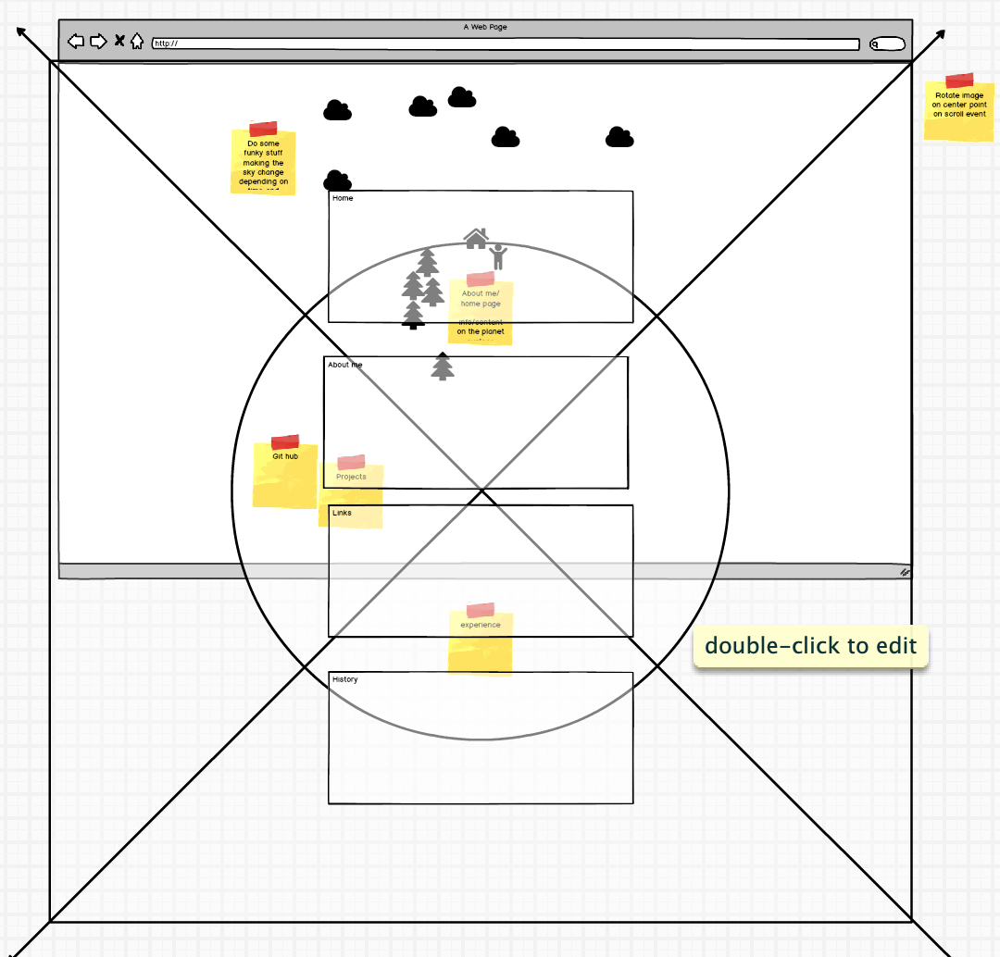
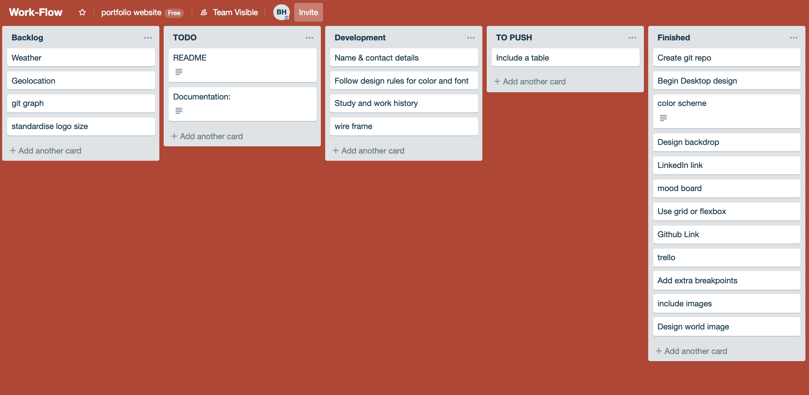
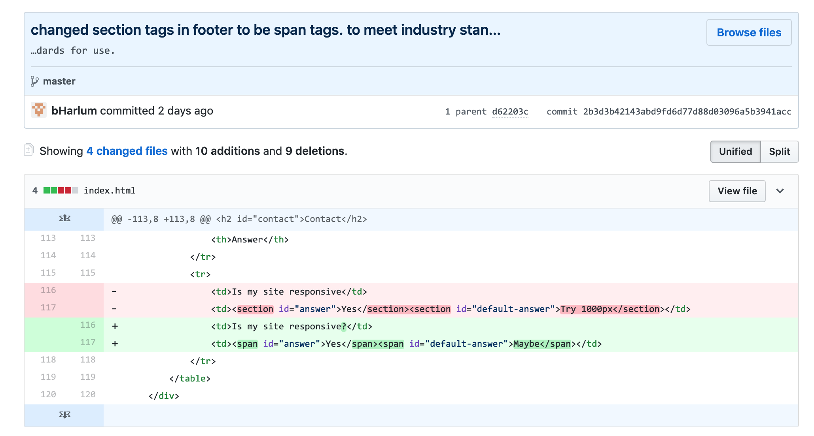

# Bryce Harlum Porfolio Website

## Goal
* To create a functional website as a brief introduction of myself and to show off my web development skills by displaying my projects to the community.

## Instructions
### How to use this site:
* Navbar: Located on the top right. Click this or press this if on a touch device. This will expand a box with a button for each section. Select the desired section to move to it on the page. Press the 'X' to close the menu.
### Supported devices
* caniuse.come
#### Java-script
* This site uses java-script for visual effects only and not required to view the site.
#### Browsers
* Chrome: Version 60 or later.
* Chrome for android: Version 71 or later.
* Android Browser: Version 67 or later.
* Safari: Version 11 or later.
* Firefox: Version 52 or later.
* Opera: Version 47 or later.
* Edge: Not supported.
* Internet Explorer: Not supported.
#### Resolutions
* Minimum resolution: 350px, 560px
* Anything below this resolution is not supported and may not work.

## Design Brief
### Mood board

* Inspiration came from monty python animations and I tired to follow this when creating the art for this design.
* Also took inspiration from tiny planet images and models.
### Colors

### fonts
* Indie Flower
* Saira Extra Condensed
### Wire-frame

* Phone wireframe
* X and surrounding box represent the background size relative to the screen.
* The circle is representative of a 'tiny world' graphic. 
* Clouds on device to hang from top from strings.
* As the user scrolls the world image will rotate. 
* Text and content will be contained in card boxs and moveas the user scrolls.

* Example of card
* Contain at least a title represented by the cirlce and text content to go below the title.

* Rotate image on scroll.

* Example of desktop site.
* Will be similar to the phone site but have a wider field of view.

## Sections
### Home
* A brief welcome message
### About me
* An Introduction paragraph
### History
* Past work and study history.
### Links
* Projects
### Contact me
* phone number and email.

## Development
### tools
#### Trello

Trello was used to track progress and prioritise tasks durring the development of the project.
#### Git

* Project Rule: Commit any time a new section, content or alteration is finished.
* Reflection: There were a few times that the rule was broken throughout the project, thus made tracking and commenting harder to maintain. Some comments were less meaniful as a result of not following the rule.
* Although the rule was not always followed there has been a definate improvement in the frequency of commits and the quality of comments. This is expected to improve further in future.
#### Balsamic
* https://balsamiq.com/
* This was used to produce the intial framework, truncating and breaking down each element to gain a better understanding of the requirements of the page and each element.
### Directories
##### local
* README.me: This file contains a breakdown of the project and instructions for the use of the website.
* index.html: contains all html content for this project. Links all style sheets can be found in the head tag. Makes use of normalize.css, style.css and fontawesome.com
##### /src
* main.js
* style.css
* normalize.css

##### src/images
* contains all logos and image files for use on the website.

### Resources
#### w3schools.com
* Hamburger menu
#### codepen.io
* Rotating elements
#### Images

### Challenges
* Design has always been challenging for me, I have never considered myself to be a good designer. After completing this project I believe that my failures in the past came from not enough preperation before diving into devlopment, designing the product as it was developed. It is my hope that this site is representative of how I changed my process and Improved my understanding of what is needed.
### Key features
* The biggest feature I wanted to implement was the rotating planet. I believe that this feature makes the site unique and attractive without distracting the user from the content.
### Stretch Goals
* In the future I would like to implement geo location to the site to adjust images depending on the local weather of the user. The requirement of this are simple but would not be able to be met within the alloted time set for this project.
### Accessibility
* The use of alt tage to identify each key element has been used to provide accessibility.
#### Alt tags
* The goal for these alt tags was to brifly describe ket elements without distracting from content. Allowing a user to navigate the ite without visual aid.

